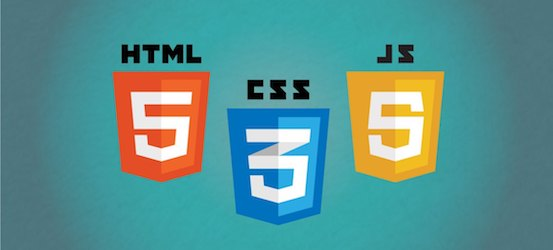
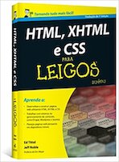
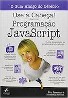
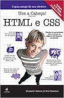

A disciplina de Tópicos Especiais do Curso Técnico em Informática Integrado ao Ensino Médio tem como objetivo apresentar ao aluno conceitos básicos sobre desenvolvimento Web Front-end, abordando tecnologias como HTML, CSS e Javascript. Sua carga horária apresenta um total de 33 horas aula e é ministrada pelo professor Diego Pessoa. Para as aulas serão utilizadas exposições e atividades práticas, além de avaliações individuais e em grupo.

## Objetivos
* Compreender o funcionamento, o histórico e as tendências futuras da rede mundial de computadores;
* Elaborar páginas em HTML com formatação simples;
* Aplicar CSS para estilização de páginas
* Implementar scripts (Javascript) para a manipulação e validação de componentes da página

## Conteúdo
* Introdução a Web e conceitos básicos
* HTML (Hypertexto, tags, atributos)
* CSS
* Javascript

Acompanhe o progresso desses conteúdos nos [roteiros de aula](docs/ROTEIRO.md)

## Avaliações

A nota final será computada através da média aritméticas das seguintes atividades:

### 1º Bimestre:
* [Avaliação I (HTML)](https://ifpb.github.io/intin-topicos/exams/prova-1.html)
* Projeto I: [especificação do projeto](exams/projeto-1.md)

### 2º Bimestre:
* Projeto II: [especificação do projeto](exams/projeto-2.md)
* Avaliação II (CSS / Javascript)

## Bibliografia

### Bibliografia básica

### Bibliografia complementar

E para completar ainda mais, acesse esses [exemplares](https://github.com/vhf/free-programming-books/blob/master/free-programming-books.md) com outras indicações.

## Referências / Inspirações
Disciplina de [Linguagens de Marcação](https://github.com/ifpb/lm) do Curso de Tecnologia de Sistemas para Internet do IFPB
