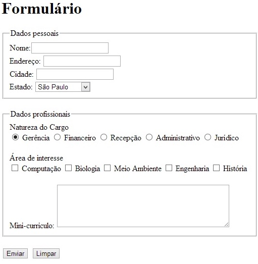

## Avaliação 1 - HTML

Objetivo: construir uma página HTML para receber currículos de alunos de IFs de todo o Brasil para auxiliar na oferta de estágios.  

Crie um site HTML contendo as seguintes páginas:
  1. Página inicial (index.html): contendo o menu de acesso e a descrição do site
  2. Objetivo: descreve o objetivo geral do site
  3. Currículos: mostra uma tabela contendo a lista de currículos alunos com os seguintes dados: nome, curso, cidade, estado, detalhes.
  4. O item detalhes da tabela deverá ser um link para a página de detalhes, contendo as seguintes informações do aluno:
    * Dados pessoais: nome, endereço, cidade, estado
    * Dados profissionais:
      * Natureza do cargo: Gerência, Financeiro, Recepção, Administrativo, Jurídico
    * Área de interesse:
      * Computação, Biologia, Meio ambiente, Engenharia, História
    * Mini-currículo
  5. Crie um formulário para cadastro do currículo de um novo aluno contendo os dados acima, conforme a figura abaixo.

  

Para submeter a prova, [clique aqui](https://goo.gl/forms/lv30hqnhRgLNqXMF3).
